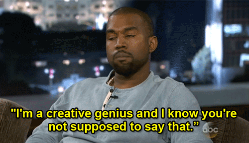

# Comments on the Kata


## Quick recap of the assignment:
> Write a binary chop method that takes an integer search target and a sorted array of integers. 
It should return the integer index of the target in the array, or -1 if the target is not in the array. 

> *Note: Even though this is the TDD category, there is not much TDD that went into this project*

This is the first time I worked on one of those famous data algorithms, so I came in with zero knowledge.

Naively, I implemented it using Python built-ins and was quickly done in a giffy:

```python
def chop(num: int, array: List[int]) -> int:
    """Given a num, returns its index in the sorted array.
    Returns -1 if the index was not found or the array is empty.
    """

    if not array:
        return -1
    if num not in array:
        return -1

    # Easy wins, we check both ends of the array
    if num == array[0]:
        return 0

    array_length = len(array)
    if num == array[array_length - 1]:
        return array_length - 1

    # Main loop
    while True:
        middle_index = len(array) // 2
        if num == array[middle_index]:
            return middle_index
        if num > array[middle_index]:
            array = array[middle_index:]
        else:
            array = array[:middle_index]
```

> Whoa! What's all the fuss about these algorithms, this was easy peasy. I'M A GENIUS!!



Satisfied with my "accomplishments", I decided it was time to eat. What I was not planning on eating was some hand made, still *hot-from-the-oven*, **humble pie**.

I wanted to compare my solution with others, so here we go, Google, my friend.

I saw the other solutions being very similar to mine — at least in the thinking — but boy oh boy did they look complex.

I thought, naaah...my solution is way simpler, why bother?

Then I decided to compare the execution time of my function with [these](https://www.geeksforgeeks.org/python-program-for-binary-search/) two from the first Google result.

For small arrays, there was no difference as they were all completing in 0.0s.

As I increased the number of elements in the testing array, I found out that while the other two functions still reported 0.0s, mine started showing durations in the ms range.


## Why was my function slower?

I'm not that advanced in these topics *yet* but I can speculate.

My function:

1. Re-assigns the array variable at every iteration. That is a lot of memory reading/writing (especially for big arrays)
2. At every call, calculates the length of the array with the ```len``` function.

The solutions from the internet:
1. Are **not** doing any work on the original array whatsoever (calculating size, reassigning, etc.)
2. Pass around only array indexes. These are light-weight variable (just ```int```)

## The final implementation
```python
def chop(num: int, array: List[int]) -> int:
    """Given a num, returns its index in the sorted array.
    Returns -1 if the index was not found or the array is empty.
    """
    if not array:
        return -1
    bottom_index = 0
    top_index = len(array) - 1

    while bottom_index <= top_index:
        mid_index = (bottom_index + top_index) // 2
        if num < array[mid_index]:
            top_index = mid_index - 1
        elif num > array[mid_index]:
            bottom_index = mid_index + 1
        else:
            return mid_index
    return -1
```

## What I have learned

### 1. Built-in functions are awesome but can make you lazy
It's easy to reach for built-in functions and be done very quickly. 

When prototyping, this is what we want. Python is great at it. 

The easiest and quickest solution might not be the most performat one though.


### 2. Replace higher-level built-ins with their underlying reason-to-be
I realize this is complicated to explain, but let me make an example to make it easier to understand what I mean.

In my first attempt, I was heavily relying on getting array slices with the ```[start:end]``` notation.

This makes for a quick solution, sure.

It also forces me to carry and modify the array throughout the function. 

What is the underlying concept that using the slices notation is helping me with?

It is helping me keeping track of our position in the exploration of the array.

Then, why can't we just drop it altogether and only keep track of the bottom and top indexes of this slide?

This is what indeed the second solution does.

## That's All Folks

Well, thanks for sticking with this blabbering till now. Hopefully this was useful, if not, please just yell at me on Twitter [@theAlexFerrari](https://twitter.com/theAlexFerrari).